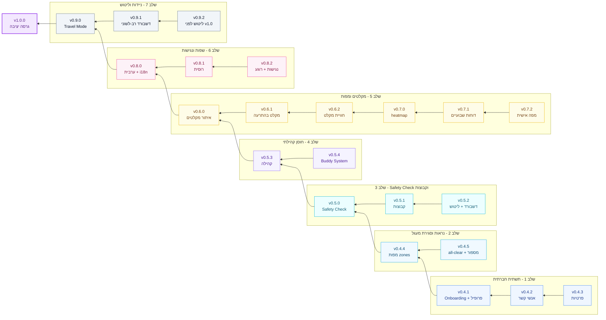

<div dir="rtl">

# מפת דרכים — בוט התראות פיקוד העורף

> מסמך זה מסודר מגרסאות יסוד ליציבות.
> כל גרסה בנויה מאפיקים גדולים, ומתחתיהם stories קטנים וברורים לביצוע.

## 🧭 איך לקרוא את המפה

- `מה הושלם` מציג את הגרסאות שכבר נסגרו.
- `מפת הדרכים` מציגה את הגרסאות הבאות ואת הכיוון המוצרי.
- כל סעיף ברמת גרסה הוא אפיק מוצר, לא task טכני.
- המטרה היא לקרוא את המסמך מימין לשמאל, כמו כל שאר הדוקומנטציה בעברית.

## 🗂️ מבט מהיר

<table dir="rtl">
  <thead>
    <tr>
      <th align="right">חלק</th>
      <th align="right">מה תמצאו שם</th>
    </tr>
  </thead>
  <tbody>
    <tr>
      <td align="right">כללי ניהול גרסאות</td>
      <td align="right">איך מספרים גרסאות, איך מתייגים, ואיך משחררים.</td>
    </tr>
    <tr>
      <td align="right">מה הושלם</td>
      <td align="right">ציר הזמן של v0.1.0 עד v0.4.0 והאבני דרך שכבר הוטמעו.</td>
    </tr>
    <tr>
      <td align="right">מפת הדרכים</td>
      <td align="right">הכיוון מ-v0.4.1 ועד v1.0.0, מסודר לפי גרסאות.</td>
    </tr>
    <tr>
      <td align="right">חזון v2.0</td>
      <td align="right">רעיונות עתידיים שאינם חלק מהמסלול הנוכחי.</td>
    </tr>
  </tbody>
</table>

## 🧾 מקרא

<table dir="rtl">
  <thead>
    <tr>
      <th align="right">סימון</th>
      <th align="right">משמעות</th>
      <th align="right">מתי רואים אותו</th>
    </tr>
  </thead>
  <tbody>
    <tr>
      <td align="right">✅ הושלם</td>
      <td align="right">גרסה שכבר יצאה ומיושמת במוצר.</td>
      <td align="right">בחלק `מה הושלם`.</td>
    </tr>
    <tr>
      <td align="right">⚪ מתוכנן</td>
      <td align="right">כיוון עתידי שעדיין לא נכנס לביצוע.</td>
      <td align="right">כל גרסה אחרי `v0.4.0` במסמך הזה.</td>
    </tr>
  </tbody>
</table>

## 🗺️ מפת גרסאות ויזואלית



<details>
<summary>איך לקרוא את המפה</summary>

- הקריאה היא מימין לשמאל, מהמצב הנוכחי אל `v1.0.0`.
- כל שלב מייצג שכבת ערך אחת במסלול המתוכנן.
- הצבעים מחלקים לשלבים בלבד, לא מסמנים ביצוע בפועל.

</details>

---

## 📐 כללי ניהול גרסאות

### גרסאות סמנטיות — `MAJOR.MINOR.PATCH`

<table dir="rtl">
  <thead>
    <tr>
      <th align="right">רמה</th>
      <th align="right">מתי להשתמש</th>
    </tr>
  </thead>
  <tbody>
    <tr>
      <td align="right"><code>PATCH</code></td>
      <td align="right">תיקוני באגים, שיפורי UX בוויזארד, אופטימיזציות ביצועים</td>
    </tr>
    <tr>
      <td align="right"><code>MINOR</code></td>
      <td align="right">פיצ'רים חדשים (תואמים לאחור)</td>
    </tr>
    <tr>
      <td align="right"><code>MAJOR</code></td>
      <td align="right">שינויים שוברים: migration של DB, הסרת API, שינוי מבנה קונפיגורציה</td>
    </tr>
  </tbody>
</table>

### שני מסלולי תיוג עצמאיים

<table dir="rtl">
  <thead>
    <tr>
      <th align="right">מסלול</th>
      <th align="right">תג</th>
      <th align="right">מה מתפרסם</th>
    </tr>
  </thead>
  <tbody>
    <tr>
      <td align="right"><strong>Bot</strong></td>
      <td align="right"><code>vX.Y.Z</code></td>
      <td align="right">Docker image → GHCR + Docker Hub</td>
    </tr>
    <tr>
      <td align="right"><strong>Wizard (npm)</strong></td>
      <td align="right"><code>wizard-vX.Y.Z</code></td>
      <td align="right">npm package <code>@haoref-boti/pikud-haoref-bot</code></td>
    </tr>
  </tbody>
</table>

שני המסלולים משתפים את אותו מספר גרסה (מסונכרן ידנית), אך מתויגים באופן עצמאי.

### צ'קליסט העלאת גרסה (Bot)

```
[ ] package.json → .version
[ ] src/index.ts → מחרוזת לוג startup
[ ] README.md → badge גרסה
[ ] CHANGELOG.md → section חדש + קישורי השוואה בתחתית
```

### צ'קליסט העלאת גרסה (Wizard)

```
[ ] wizard/package.json → .version
[ ] wizard/src/index.ts → קבוע VERSION
```

### פקודות שחרור

```bash
# Bot — שחרור Docker
git tag vX.Y.Z && git push origin vX.Y.Z
gh release create vX.Y.Z --title "vX.Y.Z" --notes "..."

# Wizard — שחרור npm
git tag wizard-vX.Y.Z && git push origin wizard-vX.Y.Z
```

---

## ✅ מה הושלם

<details>
<summary>לפתוח את הגרסאות שכבר הושלמו</summary>

### v0.1.0 — מרץ 2026 — גרסה ראשונה
- סקירת API של פיקוד העורף כל 2 שניות
- שליחת התראות לערוץ טלגרם עם מפת Mapbox
- 5 קטגוריות נושא (ביטחוני, טבע, סביבתי, תרגילים, כללי)
- התראות DM אישיות לפי עיר/אזור
- deduplication חכם עם fingerprint
- תמיכה ב-Proxy (הרצה מחוץ לישראל)

### v0.1.1–v0.1.3 — מרץ 2026
- `alertHandler` coordinator עם dependency injection
- Alert window tracker — עריכת הודעות בחלון זמן (120 שניות)
- מכסת Mapbox חודשית (SQLite) + מטמון תמונות FIFO
- Docker multi-stage build, CI/CD ב-GitHub Actions
- דף נחיתה סטטי RTL עברית (GitHub Pages)
- deduplication של newsFlash, fallback לטקסט

### v0.1.4–v0.1.6 — מרץ 2026
- היסטוריית התראות (`alert_history`, 7 ימים)
- `/stats` — סיכום 24 שעות לפי קטגוריה + ספירה אישית
- `/history [עיר]` — 10 התראות אחרונות
- שעות שקט (23:00–06:00), snooze זמני
- `DmQueue` עם מקביליות 10 + backoff אוטומטי ל-429
- **`npx @haoref-boti/pikud-haoref-bot`** — ויזארד הגדרה אינטראקטיבי בפקודה אחת

### v0.2.0–v0.2.3 — מרץ 2026
- ויזארד NPX: `--update`, `--verify`, ולידציה חיה, בחירת פלטפורמה
- **Admin Dashboard** — React SPA + glassmorphism, 7 עמודים, RTL מלא
- עיצוב מחדש של דף הנחיתה (SaaS מודרני, Heebo, Telegram blue, dark mode)
- `logger.ts` — `log()`, `logStartupHeader()`, `logAlert()` עם boxes ו-OSC 8 links
- Dashboard auth: `timingSafeEqual`, sessions ב-SQLite, 7-day TTL
- Rate limiting: 10 ניסיונות / 15 דקות per-IP, header `Retry-After`
- Overview KPI עם trends ▲/▼, skeleton loading, chart legend
- עמוד תבניות הודעה — עריכת emoji/title/prefix לכל סוג התראה ללא restart
- מפה בהירה ביום (06:00–18:00) וכהה בלילה, pins צבועים לפי סוג

### v0.3.0–v0.3.1 — מרץ 2026
- **WhatsApp Listener Bridge** — האזנה לקבוצות/ערוצים, סינון keywords, העברה לטלגרם
- שיפורי הודעות: חותמת זמן יציבה (Asia/Jerusalem), ספירת ערים, מיון אלפבתי
- Rate limiting מקיף על כל dashboard endpoints + bot callback cooldown
- Brute-force protection פרסיסטנטי (SQLite)
- **Caching O(1)**: cityLookup Maps, subscription cache, TTL stats cache, Mapbox usage cache
- ויזארד — RTL תקין בכל הטרמינלים (`bidi-js`), overhaul ויזואלי (gradient, progress bar, boxen)
- `TELEGRAM_TOPIC_ID_WHATSAPP` — topic ברירת-מחדל להעברות WhatsApp
- 391+ בדיקות אוטומטיות

### v0.3.2 — מרץ 2026
- **פורמט הודעות חדש**: תוכן/הנחיות מופיעים **לפני** רשימת הערים (נראות ב-push notification)
- כותרת ערוץ 2 שורות: `🔴 סוג\n⏰ שעה · N ערים`
- **שדרוג מפה**: `streets-v12` ביום, `navigation-night-v1` בלילה; adaptive padding; min-span לפינים
- **Strategy 2.5 — Polygon Union**: `@turf/union` ממזגת 100→2-4 צורות, דחיסת URL פי 10-20
- GitHub Sponsors, סנכרון "מה חדש?" מ-CHANGELOG, הצגת ROADMAP.md

### v0.3.3 — מרץ 2026
- **מערכת תבניות הודעה**: עורך 5 קטגוריות, בוחר אימוג'י, tooltips, איפוס per-category
- **מנוע סימולציה**: autocomplete ערים, תצוגה מקדימה בסגנון טלפון, ספירת תווים, test-fire
- **גרסאות + rollback**: 10 snapshots לכל סוג, היסטוריה עם diff
- **Import/Export**: תבניות כ-JSON, ולידציה all-or-nothing
- **ניהול Topic ID**: routing ממרכז הבקרה, hot-reload
- **Code splitting**: React.lazy + Suspense ל-10 עמודים; 945KB→364KB
- **WhatsApp Listeners UI**: 4 תת-רכיבים (ListenersBanner, KeywordHelp, RuleCard, SourceSelector)
- 672 בדיקות אוטומטיות

### v0.4.0 — מרץ 2026 (נוכחי)
- **WhatsApp Broadcast לקבוצות**: קבלת התראות פיקוד העורף ישירות ב-WhatsApp, כולל מפה, dedup, fallback
- **קטגוריה 6 — WhatsApp Forward**: קבוצות מנויות להעברות WhatsApp Listener (topic 6 בדשבורד)
- **Listener→WA broadcast**: הודעות מועברות גם לטלגרם וגם לקבוצות WhatsApp מנויות
- **שדרוג דשבורד WhatsApp**: selector חיפוש, תיקוני קטגוריות, fallback, תמיכה בערוצים+קבוצות
- **דף נחיתה: שלוש דרכים**: כרטיסי Telegram / WhatsApp / Self-host עם מידע אוטומטי מ-README
- **ויזארד: פרופילי הגדרות**: 3 פרופילים (minimal/recommended⭐/full) ל-27 משתני סביבה
- **ויזארד: שכפול מהיר**: `git clone --depth 1`, remote → upstream, הצעת fork
- ~700 בדיקות אוטומטיות

</details>

---

## 🔮 מפת דרכים — v0.4.1 עד v1.0.0


<details open>
<summary>לפתוח את המסלול מ-v0.4.1 ועד v1.0.0</summary>

> **חזון**: הפיכת הבוט ממערכת שידור חד-כיוונית ל**רשת בטיחות חברתית** — משתמשים מתחברים למשפחה, חברים ועמיתים, משתפים סטטוס בטיחות בזמן אזעקה, ומוצאים מקלטים קרובים. **פרטיות קודמת לכל**: כל משתמש שולט בדיוק מה כל איש קשר רואה.
>
> **גישה**: Social-First — v0.4.x–v0.5.x בונים תשתית חברתית מלאה עם Safety Check MVP. כל השאר (מקלטים, אנליטיקס, שפות) נבנה מעליה.

### מבט מהיר על הגרסאות הקרובות

<table dir="rtl">
  <thead>
    <tr>
      <th align="right">גרסה</th>
      <th align="right">נושא מרכזי</th>
      <th align="right">מה המשתמש מרוויח</th>
      <th align="right">סטטוס</th>
    </tr>
  </thead>
  <tbody>
    <tr>
      <td align="right"><code>v0.4.1</code></td>
      <td align="right">Onboarding ופרופיל</td>
      <td align="right">משתמש חדש נכנס למערכת עם פרופיל ברור ומסודר.</td>
      <td align="right">✅ הושלם</td>
    </tr>
    <tr>
      <td align="right"><code>v0.4.2</code></td>
      <td align="right">מערכת אנשי קשר</td>
      <td align="right">חיבור בין אנשים עם קוד, אישור, רשימה וניהול קשרים.</td>
      <td align="right">✅ הושלם</td>
    </tr>
    <tr>
      <td align="right"><code>v0.4.3</code></td>
      <td align="right">פרטיות פר-קשר</td>
      <td align="right">שליטה מדויקת במה כל איש קשר רואה.</td>
      <td align="right">⚪ מתוכנן</td>
    </tr>
    <tr>
      <td align="right"><code>v0.4.4</code></td>
      <td align="right">ויזואליזציית zones ונגישות קוגנטיבית</td>
      <td align="right">הבנה מהירה יותר של ההתרעה, כולל מפות פוליגון והנחיה ראשונה ברורה.</td>
      <td align="right">⚪ מתוכנן</td>
    </tr>
    <tr>
      <td align="right"><code>v0.4.5</code></td>
      <td align="right">All-clear ומסגור אירועים</td>
      <td align="right">סגירת מעגל ותחושת הקשר על מה קרה היום.</td>
      <td align="right">⚪ מתוכנן</td>
    </tr>
    <tr>
      <td align="right"><code>v0.5.0</code></td>
      <td align="right">Safety Check MVP</td>
      <td align="right">בדיקת מצב מהירה אחרי אזעקה.</td>
      <td align="right">⚪ מתוכנן</td>
    </tr>
    <tr>
      <td align="right"><code>v0.5.1</code></td>
      <td align="right">קבוצות</td>
      <td align="right">שיתוף סטטוס עם משפחה, חברים או עבודה.</td>
      <td align="right">⚪ מתוכנן</td>
    </tr>
    <tr>
      <td align="right"><code>v0.5.2</code></td>
      <td align="right">ליטוש Safety Check</td>
      <td align="right">דשבורד, תזכורות והעדפות חברתיות.</td>
      <td align="right">⚪ מתוכנן</td>
    </tr>
  </tbody>
</table>

<details>
<summary>v0.4.1 — תשתית Onboarding ופרופיל</summary>

<table dir="rtl">
  <thead>
    <tr>
      <th align="right">מוקד</th>
      <th align="right">מה משתנה</th>
      <th align="right">תוצאה למשתמש</th>
    </tr>
  </thead>
  <tbody>
    <tr>
      <td align="right">Onboarding + פרופיל</td>
      <td align="right">wizard ראשון, פרופיל בסיסי, ו־`/profile`.</td>
      <td align="right">משתמש חדש נכנס למערכת עם זהות ברורה ונתונים בסיסיים שמורים.</td>
    </tr>
  </tbody>
</table>

<table dir="rtl">
  <thead>
    <tr>
      <th align="right">יכולת</th>
      <th align="right">פירוט</th>
    </tr>
  </thead>
  <tbody>
    <tr>
      <td align="right">Onboarding אינטראקטיבי</td>
      <td align="right">wizard ב־`/start` שמוביל משלב זיהוי לעיר ולשם תצוגה.</td>
    </tr>
    <tr>
      <td align="right">פרופיל משתמש</td>
      <td align="right">שם תצוגה, עיר מגורים, ושפה כבר בשלב ההגדרה.</td>
    </tr>
    <tr>
      <td align="right">`/profile`</td>
      <td align="right">צפייה ועריכה של פרטי הפרופיל במקום אחד.</td>
    </tr>
    <tr>
      <td align="right">הרחבת טבלת `users`</td>
      <td align="right"><code>display_name</code>, <code>home_city</code>, <code>locale</code>, <code>onboarding_completed</code>.</td>
    </tr>
  </tbody>
</table>

</details>

<details>
<summary>v0.4.2 — מערכת אנשי קשר</summary>

<table dir="rtl">
  <thead>
    <tr>
      <th align="right">מוקד</th>
      <th align="right">מה משתנה</th>
      <th align="right">תוצאה למשתמש</th>
    </tr>
  </thead>
  <tbody>
    <tr>
      <td align="right">מערכת אנשי קשר</td>
      <td align="right">קוד חיבור, `/connect`, `/contacts`, ו־anti-spam.</td>
      <td align="right">אפשר להתחבר לאנשים, לנהל קשרים, ולשמור על מערכת מאוזנת.</td>
    </tr>
  </tbody>
</table>

<table dir="rtl">
  <thead>
    <tr>
      <th align="right">יכולת</th>
      <th align="right">פירוט</th>
    </tr>
  </thead>
  <tbody>
    <tr>
      <td align="right">קוד חיבור</td>
      <td align="right">קוד ייחודי בן 6 ספרות לכל משתמש.</td>
    </tr>
    <tr>
      <td align="right">`/connect [code]`</td>
      <td align="right">בקשת קשר הדדית עם אישור או דחייה דרך inline keyboard.</td>
    </tr>
    <tr>
      <td align="right">`/contacts`</td>
      <td align="right">רשימת אנשי קשר עם סטטוס, הסרה, ו־pagination.</td>
    </tr>
    <tr>
      <td align="right">אנטי-ספאם</td>
      <td align="right">עד 10 בקשות ממתינות עם פקיעה אחרי 7 ימים.</td>
    </tr>
    <tr>
      <td align="right">טבלאות חדשות</td>
      <td align="right"><code>contacts</code>, <code>contact_permissions</code>.</td>
    </tr>
  </tbody>
</table>

</details>

<details>
<summary>v0.4.3 — הגדרות פרטיות לכל איש קשר</summary>

<table dir="rtl">
  <thead>
    <tr>
      <th align="right">מוקד</th>
      <th align="right">מה משתנה</th>
      <th align="right">תוצאה למשתמש</th>
    </tr>
  </thead>
  <tbody>
    <tr>
      <td align="right">פרטיות פר-קשר</td>
      <td align="right">הרשאות חדשות, `/privacy`, והצגה ברורה של מה כל אחד רואה.</td>
      <td align="right">שליטה מלאה בשיתוף מידע, בלי להעמיס על המשתמש.</td>
    </tr>
  </tbody>
</table>

<table dir="rtl">
  <thead>
    <tr>
      <th align="right">יכולת</th>
      <th align="right">פירוט</th>
    </tr>
  </thead>
  <tbody>
    <tr>
      <td align="right">הרשאות per-contact</td>
      <td align="right">סטטוס בטיחות, עיר מגורים, וזמן עדכון לכל איש קשר.</td>
    </tr>
    <tr>
      <td align="right">תבנית ברירת מחדל</td>
      <td align="right">`/privacy` מגדיר ברירות מחדל לאנשי קשר חדשים.</td>
    </tr>
    <tr>
      <td align="right">תצוגת איש קשר</td>
      <td align="right">מה הוא משתף איתך ומה אתה משתף איתו.</td>
    </tr>
  </tbody>
</table>

</details>

<details>
<summary>v0.4.4 — ויזואליזציית אזורים חכמה ונגישות קוגניטיבית ⭐</summary>

<table dir="rtl">
  <thead>
    <tr>
      <th align="right">מוקד</th>
      <th align="right">מה משתנה</th>
      <th align="right">תוצאה למשתמש</th>
    </tr>
  </thead>
  <tbody>
    <tr>
      <td align="right">נראות והבנה מיידית</td>
      <td align="right">Action-first, zones בצבע, פוליגונים, countdown, ו־layout עקבי.</td>
      <td align="right">אפשר להבין מהר האם צריך לרוץ, ואיפה בדיוק.</td>
    </tr>
  </tbody>
</table>

<table dir="rtl">
  <thead>
    <tr>
      <th align="right">יכולת</th>
      <th align="right">פירוט</th>
    </tr>
  </thead>
  <tbody>
    <tr>
      <td align="right">Action Card</td>
      <td align="right">שורה ראשונה תמיד פעולה ברורה.</td>
    </tr>
    <tr>
      <td align="right">Personal Relevance Indicator</td>
      <td align="right">מציין אם ההתרעה רלוונטית אליך מיד.</td>
    </tr>
    <tr>
      <td align="right">צבע קבוע ל־28 zones</td>
      <td align="right">אותו צבע בכל ערוץ ובמפה.</td>
    </tr>
    <tr>
      <td align="right">מפת התראות מקדימות לפי zones</td>
      <td align="right">הודעות מוקדמות מציגות פוליגונים לפי אזורי התרעה, לא לפי ערים.</td>
    </tr>
    <tr>
      <td align="right">אימוג'י דחיפות לפי countdown</td>
      <td align="right">סימון חזותי לפי טווחי זמן קצרים.</td>
    </tr>
    <tr>
      <td align="right">Countdown ויזואלי</td>
      <td align="right">פס טקסטואלי קצר שנקלט מהר יותר ממספר חשוף.</td>
    </tr>
    <tr>
      <td align="right">מיון לפי דחיפות</td>
      <td align="right">האזורים הדחופים מופיעים ראשונים.</td>
    </tr>
    <tr>
      <td align="right">Summary line</td>
      <td align="right">סיכום קצר של מספר אזורים, ערים וזמן משוער.</td>
    </tr>
    <tr>
      <td align="right">Zone headers</td>
      <td align="right">כותרת מועשרת עם צבע, שם, ספירה וזמן.</td>
    </tr>
    <tr>
      <td align="right">Consistent Layout</td>
      <td align="right">אותו מבנה קבוע בכל הודעה.</td>
    </tr>
    <tr>
      <td align="right">Icon-First Design</td>
      <td align="right">כל מידע קריטי מקבל סימון חזותי מהיר.</td>
    </tr>
    <tr>
      <td align="right">מפה + legend + גבולות</td>
      <td align="right">מקרא צבעים וקווי הפרדה ברורים בין zones.</td>
    </tr>
    <tr>
      <td align="right">ערוצי הפצה</td>
      <td align="right">חל על ערוץ, DM, ו־WhatsApp.</td>
    </tr>
  </tbody>
</table>

</details>

<details>
<summary>v0.4.5 — all-clear ומעקב אירועים</summary>

<table dir="rtl">
  <thead>
    <tr>
      <th align="right">מוקד</th>
      <th align="right">מה משתנה</th>
      <th align="right">תוצאה למשתמש</th>
    </tr>
  </thead>
  <tbody>
    <tr>
      <td align="right">סגירת מעגל</td>
      <td align="right">all-clear, `/today`, מספור אירועים, ודחיסת הקשר.</td>
      <td align="right">יותר תחושת שליטה ופחות חוסר ודאות אחרי אירוע.</td>
    </tr>
  </tbody>
</table>

<table dir="rtl">
  <thead>
    <tr>
      <th align="right">יכולת</th>
      <th align="right">פירוט</th>
    </tr>
  </thead>
  <tbody>
    <tr>
      <td align="right">הודעת "שקט חזר"</td>
      <td align="right">הודעת closure אחרי 10 דקות בלי אזעקות חדשות באזור.</td>
    </tr>
    <tr>
      <td align="right">`/today`</td>
      <td align="right">מיני־דשבורד של כל אזעקות היום עם סטטוס לכל אירוע.</td>
    </tr>
    <tr>
      <td align="right">מספור אירועים</td>
      <td align="right">מספר רציף שמוסיף הקשר לכל הודעה.</td>
    </tr>
    <tr>
      <td align="right">Alert Density Indicator</td>
      <td align="right">הצגת עומס יומי ביחס לממוצע כדי לייצר הקשר ולהפחית חרדה.</td>
    </tr>
  </tbody>
</table>

</details>

<details>
<summary>v0.5.0 — MVP של בדיקת בטיחות ⭐</summary>

<table dir="rtl">
  <thead>
    <tr>
      <th align="right">מוקד</th>
      <th align="right">מה משתנה</th>
      <th align="right">תוצאה למשתמש</th>
    </tr>
  </thead>
  <tbody>
    <tr>
      <td align="right">בדיקת מצב</td>
      <td align="right">prompt מהיר אחרי אזעקה, סטטוס, ו־dedup.</td>
      <td align="right">אפשר לדווח מצב בקלות ולשלוח שקט למשפחה/חברים.</td>
    </tr>
  </tbody>
</table>

<table dir="rtl">
  <thead>
    <tr>
      <th align="right">יכולת</th>
      <th align="right">פירוט</th>
    </tr>
  </thead>
  <tbody>
    <tr>
      <td align="right">"אני בסדר"</td>
      <td align="right">prompt מהיר אחרי אזעקה עם שלוש תשובות קבועות.</td>
    </tr>
    <tr>
      <td align="right">`/status`</td>
      <td align="right">עדכון ידני וצפייה בסטטוס אנשי קשר לפי הרשאות.</td>
    </tr>
    <tr>
      <td align="right">התראות סטטוס</td>
      <td align="right">עדכון אוטומטי לכל מי שמורשה לראות את המצב.</td>
    </tr>
    <tr>
      <td align="right">dedup</td>
      <td align="right">אחד לכל אירוע, לפי fingerprint.</td>
    </tr>
    <tr>
      <td align="right">auto-reset</td>
      <td align="right">איפוס אוטומטי אחרי 24 שעות.</td>
    </tr>
    <tr>
      <td align="right">טבלאות חדשות</td>
      <td align="right"><code>safety_status</code>, <code>safety_prompts</code>.</td>
    </tr>
  </tbody>
</table>

</details>

<details>
<summary>v0.5.1 — קבוצות (משפחה / חברים / עבודה)</summary>

<table dir="rtl">
  <thead>
    <tr>
      <th align="right">מוקד</th>
      <th align="right">מה משתנה</th>
      <th align="right">תוצאה למשתמש</th>
    </tr>
  </thead>
  <tbody>
    <tr>
      <td align="right">קבוצות</td>
      <td align="right">יצירה, הצטרפות, ומסך סטטוס קבוצתי.</td>
      <td align="right">אפשר לנהל משפחה, חברים ועבודה כיחידה אחת.</td>
    </tr>
  </tbody>
</table>

<table dir="rtl">
  <thead>
    <tr>
      <th align="right">יכולת</th>
      <th align="right">פירוט</th>
    </tr>
  </thead>
  <tbody>
    <tr>
      <td align="right">`/group create [name]`</td>
      <td align="right">יצירת קבוצה עם קוד הזמנה, עד 20 חברים ועד 5 קבוצות.</td>
    </tr>
    <tr>
      <td align="right">`/group join [code]`</td>
      <td align="right">הצטרפות שמאשרת שיתוף סטטוס עם חברי הקבוצה.</td>
    </tr>
    <tr>
      <td align="right">מסך סטטוס קבוצתי</td>
      <td align="right">שם, סטטוס, עיר, וסיכום X/Y בסדר.</td>
    </tr>
    <tr>
      <td align="right">התראות קבוצתיות</td>
      <td align="right">אזעקה של חבר מפיצה עדכון לכל הקבוצה.</td>
    </tr>
    <tr>
      <td align="right">טבלאות חדשות</td>
      <td align="right"><code>groups</code>, <code>group_members</code>.</td>
    </tr>
  </tbody>
</table>

</details>

<details>
<summary>v0.5.2 — דשבורד Safety Check וליטוש</summary>

<table dir="rtl">
  <thead>
    <tr>
      <th align="right">מוקד</th>
      <th align="right">מה משתנה</th>
      <th align="right">תוצאה למשתמש</th>
    </tr>
  </thead>
  <tbody>
    <tr>
      <td align="right">ליטוש ותפעול</td>
      <td align="right">דשבורד, תזכורות, טוגלים, והקשר לסטטוס.</td>
      <td align="right">יותר שליטה, יותר נראות, ופחות חיכוך בשימוש יומיומי.</td>
    </tr>
  </tbody>
</table>

<table dir="rtl">
  <thead>
    <tr>
      <th align="right">יכולת</th>
      <th align="right">פירוט</th>
    </tr>
  </thead>
  <tbody>
    <tr>
      <td align="right">לשונית Safety Check</td>
      <td align="right">KPIs, response rate, breakdown, ומגמה 7 ימים.</td>
    </tr>
    <tr>
      <td align="right">"הכל בסדר" מהיר</td>
      <td align="right">שליחת הודעה מותאמת לכל אנשי הקשר בלחיצה אחת.</td>
    </tr>
    <tr>
      <td align="right">תזכורת עדינה</td>
      <td align="right">באנר ב־menu אם יש אזעקה באזור ולא עדכנת.</td>
    </tr>
    <tr>
      <td align="right">העדפות חברתיות</td>
      <td align="right">טוגלים להתראות סטטוס ואזעקות באזור אנשי קשר.</td>
    </tr>
    <tr>
      <td align="right">ספירת אנשי קשר ב־DM</td>
      <td align="right">הצגת מספר אנשי הקשר באזור בהודעת האזעקה.</td>
    </tr>
  </tbody>
</table>

</details>

<details>
<summary>v0.5.3 — תכונות קהילתיות</summary>


<table dir="rtl">
  <thead>
    <tr>
      <th align="right">מטרה</th>
      <th align="right">מיקוד</th>
      <th align="right">תוצאה</th>
    </tr>
  </thead>
  <tbody>
    <tr>
      <td align="right">חוסן קהילתי</td>
      <td align="right">Community Pulse, stories, skills sharing, neighbor check</td>
      <td align="right">חיזוק תמיכה הדדית ותחושת שייכות אחרי אזעקות.</td>
    </tr>
  </tbody>
</table>

<table dir="rtl">
  <thead>
    <tr>
      <th align="right">יכולת</th>
      <th align="right">פירוט</th>
    </tr>
  </thead>
  <tbody>
    <tr>
      <td align="right">Community Pulse</td>
      <td align="right">סקר אנונימי אחרי גל אזעקות עם תוצאות מצטברות.</td>
    </tr>
    <tr>
      <td align="right">Shelter Stories</td>
      <td align="right">ערוץ opt-in להודעות קצרות אחרי אזעקה עם אישור admin.</td>
    </tr>
    <tr>
      <td align="right">Skills Sharing</td>
      <td align="right">סימון יכולות בפרופיל כדי לחבר בין מי שצריך עזרה למתנדבים קרובים.</td>
    </tr>
    <tr>
      <td align="right">Neighbor Check</td>
      <td align="right">הצעה יזומה לבדוק שכנים שפתוחים לבדיקה.</td>
    </tr>
  </tbody>
</table>

</details>

<details>
<summary>v0.5.4 — מעגל חוסן (Buddy System)</summary>


<table dir="rtl">
  <thead>
    <tr>
      <th align="right">מטרה</th>
      <th align="right">מיקוד</th>
      <th align="right">תוצאה</th>
    </tr>
  </thead>
  <tbody>
    <tr>
      <td align="right">מעגלי אחריות</td>
      <td align="right">Buddy System, prompts, shelter buddy</td>
      <td align="right">יותר ודאות שמישהו בודק כל אדם ברגעים קריטיים.</td>
    </tr>
  </tbody>
</table>

<table dir="rtl">
  <thead>
    <tr>
      <th align="right">יכולת</th>
      <th align="right">פירוט</th>
    </tr>
  </thead>
  <tbody>
    <tr>
      <td align="right">קבוצת חוסן</td>
      <td align="right">5-8 אנשים שמתחייבים לבדוק אחד את השני.</td>
    </tr>
    <tr>
      <td align="right">Buddy System</td>
      <td align="right">לכל חבר מוקצה buddy קבוע עם שרשרת אחריות ברורה.</td>
    </tr>
    <tr>
      <td align="right">"בדקת את [שם]?"</td>
      <td align="right">prompt אוטומטי עם כפתורי תגובה פשוטים אחרי אזעקה.</td>
    </tr>
    <tr>
      <td align="right">Shelter Buddy</td>
      <td align="right">התאמה בין אנשים שמחפשים ליווי למקלט לבין מלווים קרובים.</td>
    </tr>
  </tbody>
</table>

</details>

<details>
<summary>v0.6.0 — איתור מקלטים (אינטגרציית GovMap)</summary>


<table dir="rtl">
  <thead>
    <tr>
      <th align="right">מטרה</th>
      <th align="right">מיקוד</th>
      <th align="right">תוצאה</th>
    </tr>
  </thead>
  <tbody>
    <tr>
      <td align="right">איתור מקלטים</td>
      <td align="right">GovMap, cache, `/shelter`, ניווט</td>
      <td align="right">גישה מהירה למקלטים קרובים עם נתוני מיקום שימושיים.</td>
    </tr>
  </tbody>
</table>

- **אינטגרציה עם GovMap API**: שכבה 417 (מקלטים ציבוריים), cache ב-SQLite, רענון שבועי
- **`/shelter`**: 3 מקלטים קרובים לעיר המגורים, עם כתובת, מרחק, זמן הליכה
- **ניווט**: כפתורי `🗺️ Waze` / `📍 Google Maps` עם קישור ישיר
- **GPS**: שליחת מיקום לתוצאות מדויקות יותר
- טבלה חדשה: `shelters`

</details>

<details>
<summary>v0.6.1 — מקלטים בתוך הקשר ההתרעה</summary>


<table dir="rtl">
  <thead>
    <tr>
      <th align="right">מטרה</th>
      <th align="right">מיקוד</th>
      <th align="right">תוצאה</th>
    </tr>
  </thead>
  <tbody>
    <tr>
      <td align="right">הקשר בזמן אזעקה</td>
      <td align="right">מקלט ב-DM, `/sheltermap`, dashboard refresh</td>
      <td align="right">המקלטים מופיעים בדיוק ברגע שצריך אותם.</td>
    </tr>
  </tbody>
</table>

- **כפתור מקלט ב-DM**: "🏃 מקלט קרוב" בהודעת אזעקה (אם יש data)
- **`/sheltermap`**: מפת Mapbox עם סימון 3 מקלטים קרובים
- **דשבורד**: סטטיסטיקות מקלטים, כפתור "רענן עכשיו"

</details>

<details>
<summary>v0.6.2 — ניווט וחוויית מקלט מתקדמת</summary>


<table dir="rtl">
  <thead>
    <tr>
      <th align="right">מטרה</th>
      <th align="right">מיקוד</th>
      <th align="right">תוצאה</th>
    </tr>
  </thead>
  <tbody>
    <tr>
      <td align="right">חוויית ניווט</td>
      <td align="right">פרטים, מקלט מועדף, שיתוף בקבוצה</td>
      <td align="right">פחות החלטות בזמן לחץ ויותר התאמה אישית.</td>
    </tr>
  </tbody>
</table>

- **תצוגת פרטים**: כתובת מלאה, סוג, קיבולת, שעות פעילות
- **מקלט מועדף**: שמירת מקלט מועדף → מופיע ראשון
- **מקלט בקבוצה**: בסטטוס קבוצתי — "✅ [שם] בסדר — מקלט: [שם] (200מ')"

</details>

<details>
<summary>v0.7.0 — מפת חום ואנליטיקה חזותית</summary>


<table dir="rtl">
  <thead>
    <tr>
      <th align="right">מטרה</th>
      <th align="right">מיקוד</th>
      <th align="right">תוצאה</th>
    </tr>
  </thead>
  <tbody>
    <tr>
      <td align="right">הבנה חזותית</td>
      <td align="right">heatmap, analytics, CSV export</td>
      <td align="right">תמונה ברורה של דפוסי אזעקות והפקת תובנות.</td>
    </tr>
  </tbody>
</table>

- **`/heatmap`**: מפת חום של אזעקות (7/30 יום) על בסיס `alert_history`
- **דשבורד — אנליטיקס מורחב**: heatmap אינטראקטיבי, Top 10 ערים, alerts לפי שעה/יום, breakdown לפי קטגוריה
- **ייצוא CSV**: הורדת נתוני אזעקות מהדשבורד

</details>

<details>
<summary>v0.7.1 — דוח שבועי והתראות מגמה</summary>


<table dir="rtl">
  <thead>
    <tr>
      <th align="right">מטרה</th>
      <th align="right">מיקוד</th>
      <th align="right">תוצאה</th>
    </tr>
  </thead>
  <tbody>
    <tr>
      <td align="right">התראות יזומות</td>
      <td align="right">דוחות שבועיים, trend alerts, scheduler</td>
      <td align="right">מעבר ממידע תגובתי לתובנות שמסייעות להיערך מראש.</td>
    </tr>
  </tbody>
</table>

- **דוח שבועי** (opt-in): ראשון 10:00 — סיכום אזעקות באזור, השוואה לשבוע קודם, מגמה
- **התראת מגמה** (opt-in): עלייה של 50%+ → הודעה פרואקטיבית (פעם ביום, 08:00–20:00)
- **Scheduler**: מנגנון תזמון חדש לדוחות ובדיקת מגמות

</details>

<details>
<summary>v0.7.2 — מפה אישית והנתונים שלי</summary>


<table dir="rtl">
  <thead>
    <tr>
      <th align="right">מטרה</th>
      <th align="right">מיקוד</th>
      <th align="right">תוצאה</th>
    </tr>
  </thead>
  <tbody>
    <tr>
      <td align="right">מבט אישי</td>
      <td align="right">`/mymap`, `/mystats`, מצב אישי</td>
      <td align="right">כל משתמש מבין במהירות את ההקשר האישי שלו.</td>
    </tr>
  </tbody>
</table>

- **`/mymap`**: מפה עם כל הערים המנויות (🔵), עיר מגורים (🟡), אזעקות פעילות (🔴)
- **`/mystats`**: סטטיסטיקות אישיות — סה"כ אזעקות, עיר הכי מותקפת, רצף שקט, response rate

</details>

<details>
<summary>v0.8.0 — תשתית i18n וערבית</summary>


<table dir="rtl">
  <thead>
    <tr>
      <th align="right">מטרה</th>
      <th align="right">מיקוד</th>
      <th align="right">תוצאה</th>
    </tr>
  </thead>
  <tbody>
    <tr>
      <td align="right">רב-לשוניות</td>
      <td align="right">i18n, Arabic, language picker</td>
      <td align="right">חוויית שימוש נגישה לקהל רחב יותר בלי לשנות את הליבה.</td>
    </tr>
  </tbody>
</table>

- **מסגרת i18n**: קבצי תרגום key-based (`he.ts`, `ar.ts`), פונקציית `t(key, locale, params?)`
- **`/language`**: בחירת שפה (עברית / العربية)
- **תרגום ערבי מלא**: כל UI הבוט — תפריטים, כפתורים, הודעות מערכת, Safety Check
- ההתראות עצמן נשארות בעברית (מ-API של פיקוד העורף)

</details>

<details>
<summary>v0.8.1 — תרגום לרוסית</summary>


<table dir="rtl">
  <thead>
    <tr>
      <th align="right">מטרה</th>
      <th align="right">מיקוד</th>
      <th align="right">תוצאה</th>
    </tr>
  </thead>
  <tbody>
    <tr>
      <td align="right">שפה נוספת</td>
      <td align="right">תרגום רוסי, LTR validation</td>
      <td align="right">כיסוי לעוד קהל דובר שפה אחרת בלי לשבור ממשקים.</td>
    </tr>
  </tbody>
</table>

- **`src/i18n/ru.ts`**: תרגום רוסי מלא
- **LTR**: וידוא שכל ה-inline keyboards תקינות ברוסית

</details>

<details>
<summary>v0.8.2 — מצב נגישות ומצב רוגע</summary>


<table dir="rtl">
  <thead>
    <tr>
      <th align="right">מטרה</th>
      <th align="right">מיקוד</th>
      <th align="right">תוצאה</th>
    </tr>
  </thead>
  <tbody>
    <tr>
      <td align="right">נגישות ורוגע</td>
      <td align="right">Accessibility mode, keyboard nav, calm mode</td>
      <td align="right">מוצר פחות עמוס ויותר תומך ברגעי לחץ.</td>
    </tr>
  </tbody>
</table>

- **`/accessibility`**: מצב נגישות — ללא אימוג'ים, טקסט ברור, הנחיות מורחבות
- **ניווט מקלדת**: `/1`, `/2`, `/3` ל-Safety Check; `/help` עם רשימת פקודות
- **Calm Mode — "רגע של נשימה"** (opt-in): אחרי כל אזעקה, הודעת follow-up אחרי 2 דקות — "🫁 נשום עמוק. שאף 4 שניות, עצור 4, נשוף 4. האזעקה הסתיימה / עדיין פעילה." — מיועד לאנשים עם PTSD/חרדה

</details>

<details>
<summary>v0.9.0 — מצב מסע ומיקום מתקדם</summary>


<table dir="rtl">
  <thead>
    <tr>
      <th align="right">מטרה</th>
      <th align="right">מיקוד</th>
      <th align="right">תוצאה</th>
    </tr>
  </thead>
  <tbody>
    <tr>
      <td align="right">ניידות</td>
      <td align="right">travel mode, GPS, temporary subscriptions</td>
      <td align="right">התראות נכונות גם כשמשתמשים נמצאים מחוץ לעיר הבית.</td>
    </tr>
  </tbody>
</table>

- **`/travel [city]`**: התראות זמניות לעיר ביקור (72 שעות, ללא שינוי מנויים קבועים)
- **Safety Check + מסע**: prompt גם לערי מסע, סטטוס "✅ בסדר (נמצא ב[עיר])"
- **מיקום GPS**: שליחת live location → אזעקות לפי העיר הקרובה

</details>

<details>
<summary>v0.9.1 — תרגום בדשבורד וניהול מקלטים</summary>


<table dir="rtl">
  <thead>
    <tr>
      <th align="right">מטרה</th>
      <th align="right">מיקוד</th>
      <th align="right">תוצאה</th>
    </tr>
  </thead>
  <tbody>
    <tr>
      <td align="right">תפעול מתקדם</td>
      <td align="right">dashboard translations, shelter management, stats</td>
      <td align="right">כלי ניהול מלאים יותר לצוות שמתחזק את המערכת.</td>
    </tr>
  </tbody>
</table>

- **דשבורד — עמוד שפות**: עורך תרגומים, אחוז השלמה, ייצוא/ייבוא JSON
- **דשבורד — עמוד מקלטים**: מפה, ספירה לפי עיר, רענון, הוספה ידנית
- **שיפורי Safety Check בדשבורד**: סטטיסטיקות קבוצות, timeline אירועים

</details>

<details>
<summary>v0.9.2 — ליטוש לפני v1.0</summary>


<table dir="rtl">
  <thead>
    <tr>
      <th align="right">מטרה</th>
      <th align="right">מיקוד</th>
      <th align="right">תוצאה</th>
    </tr>
  </thead>
  <tbody>
    <tr>
      <td align="right">ליטוש סופי</td>
      <td align="right">performance, security, tests, docs</td>
      <td align="right">הכנה מסודרת לשחרור יציב ולא אימפרוביזציה של הרגע האחרון.</td>
    </tr>
  </tbody>
</table>

- **ביצועים**: audit על שאילתות DB, ניהול זיכרון, load test ל-Safety Check
- **אבטחה**: rate limiting על כל הנתיבים, ולידציה, enforcement פרטיות, SQL injection review
- **כיסוי בדיקות**: 90%+ על כל המודולים החדשים
- **תיעוד**: עדכון CLAUDE.md, README, CHANGELOG, .env.example

</details>

<details>
<summary>v1.0.0 — גרסה יציבה ⭐</summary>


<table dir="rtl">
  <thead>
    <tr>
      <th align="right">מטרה</th>
      <th align="right">מיקוד</th>
      <th align="right">תוצאה</th>
    </tr>
  </thead>
  <tbody>
    <tr>
      <td align="right">שחרור יציב</td>
      <td align="right">stability, docs, coverage, security</td>
      <td align="right">גרסה מוכנה לפרודקשן עם בסיס נקי להמשך הדרך.</td>
    </tr>
  </tbody>
</table>

- כל הפיצ'רים מ-v0.4.1 עד v0.9.2 — יציבים ומאוחדים
- 90%+ כיסוי בדיקות
- עברית + ערבית + רוסית מלא
- תיעוד: README מעודכן, user guide, API docs (OpenAPI/Swagger), contributing guide
- דף נחיתה v2: סקשן "רשת בטיחות", מאתר מקלטים, תמיכה רב-שפתית
- Security audit + performance benchmarks

<details>
<summary>תמונת יעד עבור v1.0</summary>


<table dir="rtl">
  <thead>
    <tr>
      <th align="right">אזור</th>
      <th align="right">מה צריך להיות קיים</th>
    </tr>
  </thead>
  <tbody>
    <tr>
      <td align="right">ליבה</td>
      <td align="right">התראות אמינות, מפות ברורות, ו־DM/ערוץ/WhatsApp עקביים.</td>
    </tr>
    <tr>
      <td align="right">חברתי</td>
      <td align="right">פרופיל, אנשי קשר, פרטיות, קבוצות, ו־Safety Check.</td>
    </tr>
    <tr>
      <td align="right">חוויית משתמש</td>
      <td align="right">RTL מלא, נגישות, טקסטים קלים לקריאה, ומסכים שמרגיעים במקום להעמיס.</td>
    </tr>
    <tr>
      <td align="right">תפעול</td>
      <td align="right">דשבורד, מדדים, לוגים, ובדיקות שמאפשרים לתחזק את המערכת בביטחון.</td>
    </tr>
    <tr>
      <td align="right">שחרור</td>
      <td align="right">גרסה מתויגת, מתועדת, ומוכנה לשימוש רחב.</td>
    </tr>
  </tbody>
</table>

</details>

---

</details>

## 🚀 חזון v2.0 — עתידי


<details>
<summary>לפתוח רעיונות עתידיים אחרי v1.0</summary>

<table dir="rtl">
  <thead>
    <tr>
      <th align="right">כיוון</th>
      <th align="right">מה זה מוסיף</th>
      <th align="right">למה זה מעניין</th>
    </tr>
  </thead>
  <tbody>
    <tr>
      <td align="right">פלטפורמה פתוחה</td>
      <td align="right">API, Web App, multi-tenant, automation</td>
      <td align="right">מעבר מבוט שימושי למערכת חירום רחבה יותר.</td>
    </tr>
  </tbody>
</table>

- **WhatsApp Safety Check** — הרחבת שיתוף סטטוס ל-WhatsApp
- **Webhook / Public API** — REST API לצד שלישי (בית חכם, מערכות ארגוניות)
- **PWA / Web App** — דשבורד למשתמש קצה (לא רק admin) עם push notifications
- **Bot-as-a-Service** — multi-tenant לארגונים
- **AI-powered insights** — זיהוי אנומליות, תחזיות
- **דירוגי מקלטים** — crowdsourcing איכות + תמונות
- **שילוב שירותי חירום** — סטטוס "צריך עזרה" → התראה אופציונלית לגורמי חירום

> יש רעיונות או בקשות? פתחו [issue](https://github.com/yonatan2021/pikud-haoref-bot/issues) בגיטהאב.

</details>

</div>
